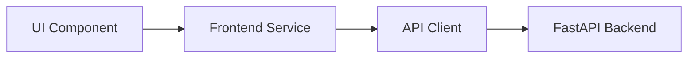

# Project Rules & Guidelines

## Pull Request Documentation Standard

Whenever generating or drafting a Pull Request (PR) title, summary, or description for this repository, you **MUST** format the PR description using the following template structure and sections:

---

### Pull Request Format Template

```markdown
## 📌 Summary
<!-- Concise high-level overview of the feature, refactor, or fix, explaining its architectural purpose and downstream integration. -->

──────

## 🎯 Motivation & Key Capabilities
<!-- Bulleted breakdown of core capabilities, UI enhancements, and domain logic implemented. Use bold lead-in tags. -->
* **Capability / Component Name**: Description of functionality, compliance standards, and edge-case handling.

──────

## 🏗️ Architecture Flow
<!-- Mermaid flowchart visualizing data flow, state management, service delegation, or component hierarchy. -->


──────

## 🚀 Components / Views Added or Modified
<!-- Markdown table detailing all new or modified UI components or views. -->
| Component | Location | Description | Props / State |
| :--- | :--- | :--- | :--- |
| ComponentName | `src/components/...` | Purpose and user interaction | `props` (type, purpose) |

──────

## 📂 File Changes
<!-- Bulleted list of every modified and created file with file link and concise explanation of additions or refactors. -->
* **filename.tsx**: Description of components, services, types, or tests modified or introduced.

──────

## 🧪 Testing & Verification
<!-- Command used to run automated test suites, followed by coverage highlights for individual test cases. -->

All automated tests pass cleanly with vitest:

```bash
npm test
```

### Test Coverage Highlights:
* ✅ `test_case_name`: Purpose and assertion verified.

──────

## ✅ Checklist
* [✓] Code follows existing React 19 / TypeScript architecture and style guidelines
* [✓] Direct prop destructuring with explicit interface used (no React.FC)
* [✓] Descriptive variable names used (no single-character variables)
* [✓] Modern event types used (no deprecated FormEvent)
* [✓] Unit and component tests written and passing
* [✓] README updated with completed roadmap item
```
